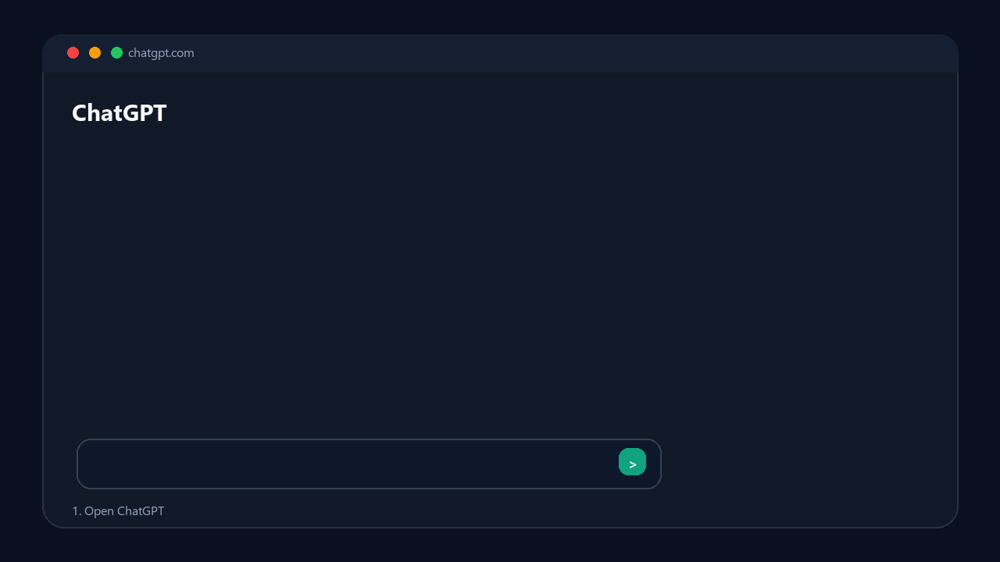
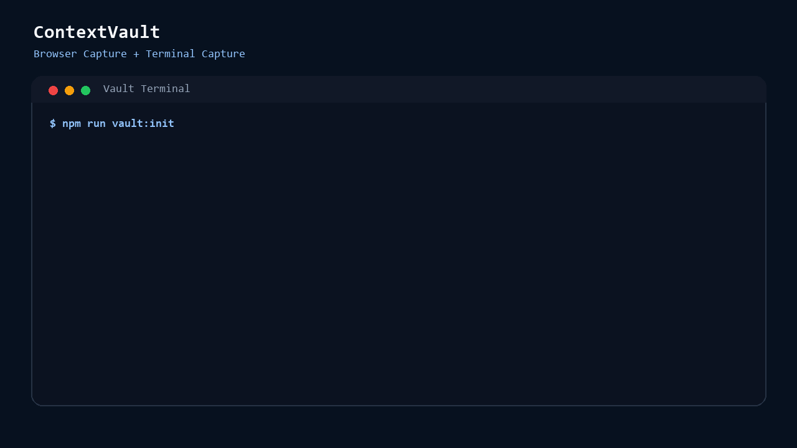
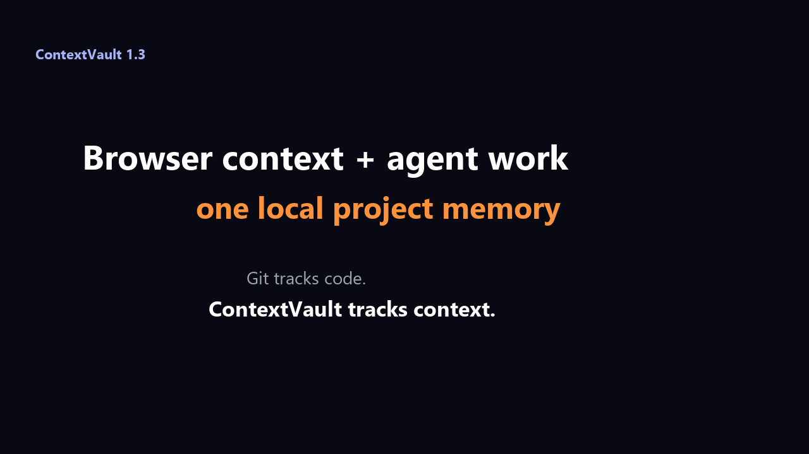
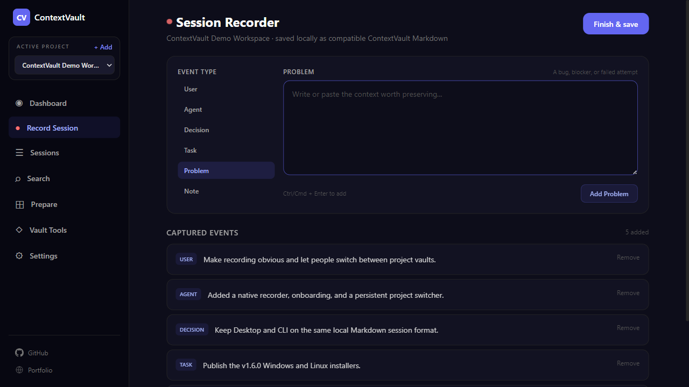
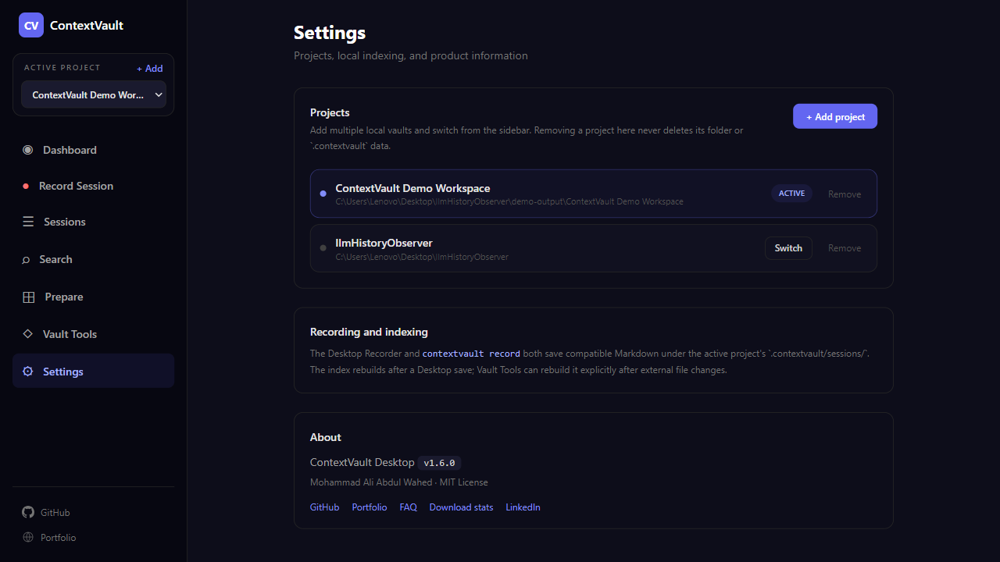

<p align="center">
  
</p>

<h1 align="center">ContextVault</h1>
<p align="center"><em>Your local-first memory layer for AI chats, coding agents, and project context.</em></p>

<p align="center">
  ContextVault captures context from browsers and terminals, stores it locally, and exports it as portable Markdown.
  It helps preserve LLM conversations, coding-agent sessions, project decisions, tasks, problems, and workflow context
  across tools.
</p>

<p align="center">
  <a href="https://context-vault-two.vercel.app/"><strong>Landing Page</strong></a>
  &middot;
  <a href="https://www.npmjs.com/package/@aliabdm/contextvault"><strong>npm</strong></a>
  &middot;
  <a href="#installation"><strong>Install</strong></a>
  &middot;
  <a href="#vault-terminal"><strong>Vault Terminal</strong></a>
  &middot;
  <a href="https://context-vault-two.vercel.app/faq"><strong>Technical FAQ</strong></a>
  &middot;
  <a href="https://context-vault-two.vercel.app/stats"><strong>Desktop Download Stats</strong></a>
  &middot;
  <a href="#roadmap"><strong>Roadmap</strong></a>
</p>

<p align="center">
  
  
  
  
  
  
  <a href="https://github.com/aliabdm/ContextVault/releases/latest"></a>
  <a href="https://www.npmjs.com/package/@aliabdm/contextvault"></a>
  <a href="https://www.npmjs.com/package/@aliabdm/contextvault"></a>
  <a href="https://context-vault-two.vercel.app/stats"></a>
</p>

<p align="center">
  <strong>No backend.</strong>
  <strong>No accounts.</strong>
  <strong>No tracking.</strong>
</p>

---

## Installation

### Desktop App (recommended)

Download the latest installer for your platform:

| Platform | Download |
|----------|----------|
| Windows | [Download for Windows](https://context-vault-two.vercel.app/download/windows) (.exe) |
| macOS | [Build from source](https://github.com/aliabdm/ContextVault#desktop-app-recommended) (`npm run package:mac`) |
| Linux | [Download for Linux](https://context-vault-two.vercel.app/download/linux) (.AppImage) |

Windows and Linux downloads resolve to the latest published release assets. The app works offline; update checks are available in packaged builds. macOS currently requires a local source build.

#### Desktop quick start

1. Open ContextVault Desktop and click **Add your first project**. Choose the local project folder you want to remember.
2. Click the red **Start recording** button on the Dashboard or **Record Session** in the sidebar.
3. Give the session a title, choose its source (Codex, Claude Code, Cursor, Terminal, Human, or Other), then click **Start recording**.
4. Add the context worth preserving as **User**, **Agent**, **Decision**, **Task**, **Problem**, or **Note** events.
5. Click **Finish & save**. The session is saved locally under `<project>/.contextvault/sessions/`, indexed, and available immediately in Sessions, Search, and Prepare Context.

Use **+ Add** in the sidebar to add more projects. The project dropdown switches the entire Desktop view between their independent local vaults. Settings can remove a project from the recent list without deleting the project or its `.contextvault` files.

The recorder is explicit: ContextVault does not listen to your screen, shell, microphone, or clipboard. If you prefer a terminal workflow, run `contextvault record` inside the same project; Desktop and CLI use the same Markdown session format.

[View privacy-friendly Desktop download statistics](https://context-vault-two.vercel.app/stats). The dashboard counts GitHub installer download events, not unique people or active installations.

> **macOS note:** The Desktop app builds successfully on macOS locally. To build the macOS `.dmg` yourself, run `cd desktop && npm run package:mac`. GitHub Actions does not include macOS installers because code signing requires an Apple Developer account. A future update may add notarized builds.

### CLI (npm)

Run Vault Terminal immediately without installing:

```bash
npx @aliabdm/contextvault init
```

Or install the CLI globally:

```bash
npm install -g @aliabdm/contextvault
contextvault init
```

Browser Capture is installed from the extension build as described in [Installation (Dev Mode)](#installation-dev-mode). The npm package provides Vault Terminal and the Unified Context Engine; it does not replace the browser extension.

## Demo

<table>
  <tr>
    <td width="50%">
      <h3 align="center">Browser Capture</h3>
      <p align="center">
        
      </p>
    </td>
    <td width="50%">
      <h3 align="center">Terminal Capture</h3>
      <p align="center">
        
      </p>
    </td>
  </tr>
</table>

### Unified Context Engine

<p align="center">
  
</p>

<p align="center">
  <a href="landing/public/demo/context-engine-demo.mp4"><strong>Watch the MP4 demo</strong></a>
</p>

### Desktop App

<table>
  <tr>
    <td width="50%"></td>
    <td width="50%"></td>
  </tr>
</table>

<p align="center">
  <a href="landing/public/demo/contextvault-desktop-demo.mp4"><strong>Watch the complete Desktop workflow (MP4)</strong></a>
</p>

The Desktop app uses the same local `.contextvault` directory as the CLI. It includes an in-app session recorder, multi-project switching, Dashboard statistics, session browsing, event timelines, filtered search, prepared context packages, project-memory refresh, timeline generation, unified index rebuilds, and full Markdown export.

<table>
  <tr>
    <td align="center"><strong>Browser Capture</strong><br />ChatGPT, Claude, Gemini, Perplexity, Poe, DeepSeek, Copilot</td>
    <td align="center"><strong>Terminal Capture</strong><br />Codex, Claude Code, Cursor workflows, human notes, decisions, tasks</td>
    <td align="center"><strong>Local Memory</strong><br />IndexedDB, local Markdown, exportable archives, no backend</td>
  </tr>
</table>

## What It Does

ContextVault is a local-first context platform with two first-class capture surfaces:

- **Browser Capture** records conversations from supported LLM web apps.
- **Terminal Capture** records human, AI, and coding-agent work sessions from the terminal.

Both surfaces store context locally. Browser exports can now be imported into the same Context Engine used by terminal sessions, so retrieval and prepared context packages can combine conversations and agent work without changing extension behavior.

---

## Two Capture Surfaces

<p>
  
  
  
  
</p>

### Browser Capture

Captures conversations from:

- ChatGPT
- Claude
- Gemini
- Perplexity
- Poe
- DeepSeek
- Copilot

Browser Capture uses a hybrid DOM + network capture engine and exports conversations as structured Markdown or ZIP files.

### Terminal Capture

Captures:

- Codex sessions
- Claude Code sessions
- Cursor workflows
- Human notes
- Decisions
- Tasks
- Problems
- Project context

Terminal Capture stores everything as local Markdown memory under `.contextvault/`.

---

## Why It Exists

AI work is powerful, but context is fragmented across too many places:

| Problem | Consequence |
| --- | --- |
| Switch models | Lose thread continuity |
| Hit token limits | Forced truncation |
| Change accounts | Orphaned conversations |
| Switch platforms | Context gets trapped in one tool |
| Switch coding agents | Decisions and attempts disappear |
| Work in terminals | Agent sessions are hard to preserve |
| Revisit old ideas later | No portable memory or search surface |

ContextVault fixes this by making browser conversations and terminal work sessions **portable, local, and reusable**.

---

## Vision

Git tracks code.

ContextVault tracks context.

The goal is to preserve knowledge, decisions, discussions, tasks, discoveries, and agent work across tools.

Context should survive:

- model switching
- platform switching
- account switching
- agent switching
- context window limits

---

## Features

<p>
  
  
  
  
</p>

| Feature | Description |
| --- | --- |
| Desktop App | Visual context manager for Windows and Linux; macOS source build supported |
| Browser Capture | Captures LLM conversations from supported browser platforms |
| Terminal Capture | Captures coding-agent, human, and project-context sessions from the terminal |
| Hybrid browser engine | DOM + network capture for browser reliability |
| Local-first storage | Browser chats stay in IndexedDB; terminal sessions stay in `.contextvault/` |
| Markdown export | Browser and terminal context can be exported as Markdown |
| ZIP export | Browser conversations can be exported in bulk as ZIP |
| Tags and project grouping | Organize captured browser conversations |
| Raw terminal memory | Preserve `/user`, `/agent`, `/decision`, `/task`, `/problem`, and `/paste` blocks without rewriting |
| Shared context model | Provider-agnostic context types for future browser, terminal, editor, and agent integrations |
| Unified browser import | Import ContextVault Markdown, ZIP, or export directories into the shared local engine |
| Cross-surface retrieval | Retrieve relevant browser messages and terminal events in one query |
| Focused context views | List recorded tasks, decisions, and problems across the unified index |
| Private by default | No backend, no accounts, no telemetry, no external AI API calls |

---

## Architecture

<p>
  
  
  
  
</p>

```text
Browser Capture                         Terminal Capture              Desktop App
DOM Observer + Network Monitor          Vault Terminal CLI            Electron UI
        |                                      |                           |
Stream Assembler                       Raw Context Events           Preload API
        |                                      |                           |
Capture Engine                         Markdown Sessions            Main Process
        |                                      |                           |
Background Service Worker              .contextvault/               Context Engine
        |                                      |                           |
IndexedDB Storage                      Local Filesystem Storage     Local Filesystem
        |                                      |                           |
 Markdown / ZIP Export                 Sessions                     Visual Output
        \                                      /                           /
         \                                    /                           /
          --------------- Shared Context Layer ---------------------------
                          |
                    Context Engine
            Normalize / Index / Retrieve
             Prepare / Memory / Link
                          |
             Markdown / ZIP / Timeline
```

Browser key idea:

- **DOM** = source of truth
- **Network** = enhancement layer
- **Stream Assembler** = final message builder

Terminal key idea:

- **Raw input** = source of truth
- **Markdown files** = durable memory
- **No summarization** = no context loss

---

## Privacy By Design

<p>
  
  
  
  
</p>

ContextVault is built around strict privacy principles:

| No | Yes |
| --- | --- |
| No backend | Everything stays local |
| No accounts | You control your own context |
| No telemetry | Export when you choose |
| No external AI APIs | Terminal capture works without calling AI services |
| No automatic cloud sync | Local files and local browser storage by default |

The `.contextvault/` folder is ignored by git by default because terminal sessions may contain raw private context, paths, prompts, logs, secrets, or customer information.

---

## Installation (Dev Mode)

```bash
npm install
npm run build
```

Then:

1. Open `chrome://extensions`
2. Enable **Developer Mode**
3. Click **Load unpacked**
4. Select the `dist/` folder

### Or Use Docker

```bash
docker compose up dev
```

This runs the extension in dev mode on `http://localhost:5173` with hot-reload.

After building, load `dist/` into Chrome as an unpacked extension.

To run the mock test server:

```bash
docker compose --profile testing up dev test-server
```

This starts both the dev server and an Nginx container serving the ChatGPT mock HTML at `http://localhost:8080`.

---

## How To Test Browser Capture

1. Open **ChatGPT / Claude / Gemini**
2. Start a conversation
3. Open the extension popup
4. Verify messages are captured
5. Export as `.md` or `.zip`
6. Confirm clean structured output

---

## Vault Terminal

Vault Terminal captures terminal-based human, AI, and coding-agent work sessions as raw Markdown context.

It is intentionally independent from the Chrome extension so browser adapters, popup behavior, permissions, IndexedDB storage, Markdown export, and ZIP export remain intact.

### Terminal Commands

The package exposes a standard `contextvault` binary. The existing `npm run vault:*` scripts remain available for repository development.

Install the published CLI:

```bash
npm install -g @aliabdm/contextvault
contextvault init
```

Or run it without a global install:

```bash
npx @aliabdm/contextvault init
```

To develop the packaged CLI from a local clone:

```bash
npm install
npm link
contextvault init
```

Initialize local terminal memory:

```bash
npm run vault:init
```

Start an interactive recorder:

```bash
npm run vault:record
```

Inside the recorder:

```text
/source codex
/title Fix auth middleware
/user The login redirect is broken.
/agent I found the issue in middleware order.
/decision Keep auth checks in middleware and policy checks in controllers.
/task Add regression test for redirect loop.
/problem Session cookie is missing on callback.
/paste
Raw multiline content goes here.
/endpaste
/end
```

List saved sessions:

```bash
npm run vault:list
```

Show the latest session or a specific session:

```bash
npm run vault:show -- latest
npm run vault:show -- <session-id>
```

Export project memory and recent sessions:

```bash
npm run vault:export
```

Search saved terminal sessions:

```bash
npm run vault:search -- auth
npm run vault:search -- "Claude Code"
```

Vault Terminal writes local files under `.contextvault/`:

```text
.contextvault/
  config.json
  memory.md
  imports/
    browser/
  sessions/
  exports/
```

### Technical Key Points

- Vault Terminal is a plain Node.js CLI in `scripts/vault-terminal.mjs`.
- It uses only local filesystem storage.
- It writes Markdown sessions to `.contextvault/sessions/`.
- It writes combined exports to `.contextvault/exports/contextvault-terminal-export.md`.
- It preserves raw input exactly as typed for `/user`, `/agent`, `/note`, `/decision`, `/task`, `/problem`, and `/paste` blocks.
- It adds a provider-agnostic context model under `src/shared/context/types.ts` for future browser, terminal, editor, or agent integrations.
- It does not add backend, auth, telemetry, analytics, or external AI API calls.

---

## Unified Context Engine

The Context Engine turns imported browser conversations and recorded terminal sessions into searchable, reusable project memory while keeping Markdown as the source of truth.

### Import Browser Conversations

Export a conversation as Markdown or all conversations as ZIP from the extension, then import it into the project vault:

```bash
npm run vault:import -- ./chatgpt-export.md
npm run vault:import -- ./contextvault-export.zip
npm run vault:import -- ./browser-exports/
```

Direct package command:

```bash
contextvault import ./contextvault-export.zip
```

Imported source files are stored under `.contextvault/imports/browser/`. Re-importing identical content is skipped. A changed export with the same `conversation_id` updates the existing imported source instead of creating another session.

Import does not extract ZIP paths to disk. It reads Markdown entries in memory, validates ContextVault frontmatter, sanitizes generated filenames, and enforces limits of 100 MB per input archive, 10 MB per Markdown file, and 1,000 Markdown files per import.

### Normalize And Index

Normalize legacy and current session files into the shared `ContextSession` and `ContextEvent` model, then build a local JSON index:

```bash
npm run vault:index
```

Output:

```text
.contextvault/index/context-index.json
```

The normalizer supports terminal snake_case fields such as `started_at`, `ended_at`, and `git_branch`, plus the browser export fields `platform`, `date`, and `conversation_id`. Browser `User` and `Assistant` sections become shared `user` and `agent` events with platform and role metadata.

### Retrieve Relevant Context

Retrieve decisions, tasks, problems, notes, and messages related to a query:

```bash
npm run vault:retrieve -- "auth middleware"
```

Retrieval is local and deterministic. It ranks phrase matches, token matches, event importance, and recency without sending context to an external model or API.

The result can include browser conversations and terminal sessions in the same response.

### Investigate Project Questions

ContextVault returns dated source evidence instead of generating an unsupported answer:

```bash
# What happened in the project during the last two weeks?
npm run vault:history -- --since 2w

# What did Codex decide about authentication?
npm run vault:decisions -- auth --source codex

# Show captured Redis problems from the last 30 days.
npm run vault:problems -- redis --since 30d

# Retrieve only Codex decisions related to auth.
npm run vault:retrieve -- auth --type decision --source codex --since 30d
```

Supported filters:

- `--type decision,task,problem,note,user,agent`
- `--source codex`, `--source browser`, or a browser platform such as `--source chatgpt`
- `--since 24h`, `--since 14d`, `--since 2w`, or an ISO date
- `--limit 10`

The engine does not currently call an LLM to synthesize prose answers. `vault:prepare` packages the relevant evidence for the agent you choose.

### Inspect Tasks, Decisions, And Problems

```bash
npm run vault:tasks
npm run vault:decisions
npm run vault:problems
```

Equivalent package commands are `contextvault tasks`, `contextvault decisions`, and `contextvault problems`.

### Prepare An Agent Context Package

Generate a focused context package for Codex, Claude Code, Cursor, or another AI tool:

```bash
npm run vault:prepare -- "auth middleware"
```

Output:

```text
.contextvault/exports/prepared-context.md
```

The package contains project memory, relevant sessions, decisions, tasks, problems, notes, source metadata, and guidance for the next agent.

### Maintain Project Memory

Refresh the generated decisions, tasks, and problems section in `memory.md`:

```bash
npm run vault:memory
```

Manual content in `memory.md` is preserved. ContextVault only replaces its marked generated block.

### Link Sessions

Create an explicit relationship between two sessions:

```bash
npm run vault:link -- <from-session-id> <to-session-id> "fixed by"
```

Links are stored locally in:

```text
.contextvault/links.json
```

### Generate A Timeline

Create a chronological project-context timeline:

```bash
npm run vault:timeline
```

Output:

```text
.contextvault/exports/context-timeline.md
```

### Engine Storage

```text
.contextvault/
  config.json
  memory.md
  links.json
  imports/
    browser/
  index/
    context-index.json
  sessions/
  exports/
    contextvault-terminal-export.md
    prepared-context.md
    context-timeline.md
```

No backend, account, vector database, embedding API, or cloud service is required.

---

## Roadmap

<p>
  
  
  
  
</p>

### Implemented

- Published `@aliabdm/contextvault` npm CLI
- Desktop App (Windows and Linux installers; macOS source build)
- Browser Capture
- Terminal Capture MVP
- Local-first browser storage
- Local-first terminal storage
- Markdown export
- Browser ZIP export
- Terminal search
- Shared context model
- Context normalization for terminal sessions and browser exports
- Markdown, ZIP, and directory browser import
- Deterministic duplicate import prevention
- Local context index
- Cross-surface query-based context retrieval
- Prepared agent context packages
- Focused task, decision, and problem views
- Filtered project history and evidence queries by source, type, and time
- Generated project memory block
- Explicit session links
- Context timeline export

### In Progress

- Browser adapter hardening
- Demo/storytelling assets

### Future

The unified Context Engine now exists. The next work is hardening retrieval and adding direct adapters that emit the same shared context model without manual export/import.

- Auto-tagging system
- Draft recovery
- Retrieval ranking improvements and optional local semantic indexing
- Automatic context linking suggestions
- Memory conflict and stale-task detection
- Optional local-model or user-configured provider adapter for grounded natural-language answers
- MCP server
- VS Code extension
- Claude Code integration
- Codex integration
- Cursor integration
- Encrypted backups
- Optional self-hosted sync

---

## Known Limitations

- Provider UI changes may require selector updates.
- Generic browser adapter is best-effort only.
- Browser storage is local to the browser profile.
- Terminal storage is local to the repository where `.contextvault/` is initialized.
- Terminal capture records explicitly entered context; it does not automatically intercept every shell process.
- Context Engine retrieval is currently lexical and deterministic; it does not use embeddings or semantic model calls.
- Browser conversations enter the Context Engine through explicit Markdown/ZIP import; automatic synchronization from IndexedDB is not implemented.
- Vault Terminal is published as `@aliabdm/contextvault`; the installed executable remains `contextvault`.
- Natural-language answer generation is not built in; current commands retrieve grounded local evidence and prepare it for an agent.

---

## Documentation & Community

**Mohammad Ali Abdul Wahed**

| | |
| --- | --- |
| GitHub | [aliabdm](https://github.com/aliabdm) |
| LinkedIn | [Mohammad Ali Abdul Wahed](https://www.linkedin.com/in/mohammad-ali-abdul-wahed-1533b9171/) |
| X (Twitter) | [@Maliano63717738](https://x.com/Maliano63717738) |
| Portfolio | [senior-mohammad-ali.vercel.app](https://senior-mohammad-ali.vercel.app/) |
| Medium | [@aliabdm](https://medium.com/@aliabdm) |
| Dev.to | [@maliano63717738](https://dev.to/maliano63717738) |

### Articles

- [I Built a Local-First Recorder for AI Coding Sessions](docs/medium-vault-terminal.md) — Medium article introducing Vault Terminal and the local-first philosophy
- More articles coming soon on [Medium](https://medium.com/@aliabdm) and [Dev.to](https://dev.to/maliano63717738)

### Community Discussions

- [GitHub Discussions](https://github.com/aliabdm/ContextVault/discussions) — Ask questions, share workflows, report issues
- [GitHub Issues](https://github.com/aliabdm/ContextVault/issues) — Bug reports and feature requests

---

## Philosophy

ContextVault is a step toward Git for Context: a portable, local-first memory layer for conversations, coding agents, project decisions, and future AI workflows.
