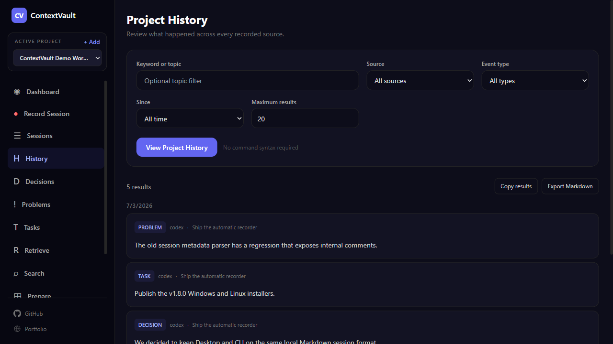
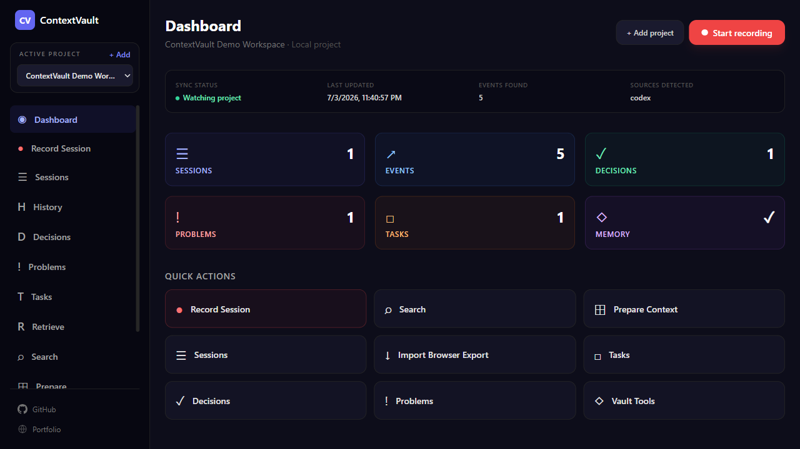

<p align="center">
  
</p>

<h1 align="center">ContextVault</h1>
<p align="center"><em>Your local-first memory layer for AI chats, coding agents, and project context.</em></p>

<p align="center">
  <a href="https://context-vault-two.vercel.app/"><strong>Landing Page</strong></a>
  &middot;
  <a href="https://www.npmjs.com/package/@aliabdm/contextvault"><strong>npm</strong></a>
  &middot;
  <a href="#installation"><strong>Install</strong></a>
  &middot;
  <a href="https://context-vault-two.vercel.app/faq"><strong>Technical FAQ</strong></a>
  &middot;
  <a href="https://context-vault-two.vercel.app/stats"><strong>Download Stats</strong></a>
  &middot;
  <a href="#roadmap"><strong>Roadmap</strong></a>
</p>

<p align="center">
  <a href="https://github.com/aliabdm/ContextVault/releases/latest"></a>
  <a href="https://www.npmjs.com/package/@aliabdm/contextvault"></a>
  
  
  
  <a href="https://www.npmjs.com/package/@aliabdm/contextvault"></a>
</p>

<p align="center">
  <strong>No backend.</strong>
  <strong>No accounts.</strong>
  <strong>No tracking.</strong>
</p>

---

## Why

AI work is powerful, but context is fragmented. Switch models, hit token limits, change accounts, switch platforms, switch coding agents — and the decisions, attempts, and threads evaporate. Your code lands in Git. Your context does not.

ContextVault fixes this by making browser conversations and terminal work sessions **portable, local, and reusable**. Git tracks code. ContextVault tracks context.

---

## Installation

### Desktop App (recommended)

Download the latest installer for your platform:

| Platform | Download |
|----------|----------|
| Windows | [Download (.exe)](https://context-vault-two.vercel.app/download/windows) |
| Linux | [Download (.AppImage)](https://context-vault-two.vercel.app/download/linux) |
| macOS | [Build from source](#develop-from-source) (`npm run package:mac`) |

Windows and Linux downloads resolve to the latest published GitHub release assets. The app works offline. macOS currently requires a local source build (no Apple Developer code-signing setup yet).

### CLI (npm)

Run immediately without installing:

```bash
npx @aliabdm/contextvault init
```

Or install globally:

```bash
npm install -g @aliabdm/contextvault
contextvault init
```

The npm package provides Vault Terminal and the Unified Context Engine. It does not replace the browser extension.

### Browser Extension (Dev Mode)

```bash
npm install
npm run build
```

Then load `dist/` into Chrome via `chrome://extensions` → Developer Mode → Load unpacked.

---

## Quick Start

### Desktop (under a minute)

1. **Add a project** — choose a local folder. Add more later and switch from the sidebar.
2. **Start recording** — name the session and choose Codex, Claude Code, Cursor, Terminal, or another source.
3. **Work visually** — use filters and result screens; sessions written by CLI or integrated agents appear live.

The Record button launches the bundled `contextvault record` process. Desktop never watches your screen or terminal in the background. Automatic classification runs on-device — no model, no API call, no telemetry.

<table>
  <tr>
    <td width="50%"></td>
    <td width="50%"></td>
  </tr>
</table>

<p align="center">
  
</p>

### Terminal

```bash
npx @aliabdm/contextvault init
contextvault record
```

Inside the recorder:

```text
/source codex
/title Fix auth middleware
/user The login redirect is broken.
/agent I found the issue in middleware order.
/decision Keep auth checks in middleware and policy checks in controllers.
/task Add regression test for redirect loop.
/problem Session cookie is missing on callback.
/end
```

Other commands:

```bash
contextvault list                      # list saved sessions
contextvault search "auth"             # search across sessions
contextvault history --since 2w        # project history, last 2 weeks
contextvault decisions auth --source codex   # Codex decisions about auth
contextvault problems redis --since 30d      # Redis problems, last 30 days
contextvault retrieve "auth middleware"       # ranked evidence retrieval
contextvault prepare "auth middleware"       # agent-ready context package
```

Supported filters: `--type`, `--source`, `--since` (`24h`, `14d`, `2w`, or ISO date), `--limit`.

---

## Demo

<table>
  <tr>
    <td width="50%">
      <h3 align="center">Browser Capture</h3>
      <p align="center"></p>
    </td>
    <td width="50%">
      <h3 align="center">Terminal Capture</h3>
      <p align="center"></p>
    </td>
  </tr>
</table>

<p align="center">
  
</p>

<table>
  <tr>
    <td width="50%"></td>
    <td width="50%"></td>
  </tr>
  <tr>
    <td colspan="2" align="center"></td>
  </tr>
</table>

---

## Features

| Feature | Description |
| --- | --- |
| Desktop App | Visual context manager for Windows and Linux; macOS source build. Multi-project support, live watched-file sync, dedicated GUI screens for every package command. |
| Browser Capture | Records conversations from ChatGPT, Claude, Gemini, Perplexity, Poe, DeepSeek, Copilot. Hybrid DOM + network engine. Exports as Markdown or ZIP. |
| Terminal Capture | Records human, AI, and coding-agent sessions from the terminal. Raw text preserved exactly — no summarization, no context loss. |
| Unified Context Engine | Imports browser exports, normalizes both sources into a shared model, indexes locally, and retrieves cross-surface evidence. |
| Local-first storage | Browser chats in IndexedDB; terminal sessions in `.contextvault/`. No backend, no cloud sync. |
| Deterministic retrieval | Phrase + token + type + recency ranking. No embeddings, no external API. Same query, same vault, same result every time. |
| Focused views | Dedicated History, Decisions, Problems, Tasks, Retrieve, Search, and Prepare screens — in Desktop and CLI. |
| Prepared context | Generates a focused Markdown package ready for the next Codex, Claude Code, Cursor, or other agent. |
| Project memory | Auto-generated decisions/tasks/problems block in `memory.md`. Manual content preserved. |
| Session links | Explicit relationships between sessions with a reason label. |
| Timeline export | Chronological project-context timeline as Markdown. |
| Private by default | No backend, no accounts, no telemetry, no external AI API calls. |

---

## Architecture

```text
Browser Capture                         Terminal Capture              Desktop App
DOM Observer + Network Monitor          Vault Terminal CLI            Electron UI
        |                                      |                           |
Stream Assembler                       Raw Context Events           Preload API
        |                                      |                           |
Capture Engine                         Markdown Sessions            Main Process
        |                                      |                           |
Background Service Worker              .contextvault/               Context Engine
        |                                      |                           |
IndexedDB Storage                      Local Filesystem Storage     Local Filesystem
        |                                      |                           |
 Markdown / ZIP Export                 Sessions                     Visual Output
        \                                      /                           /
         \                                    /                           /
          --------------- Shared Context Layer ---------------------------
                          |
                    Context Engine
            Normalize / Index / Retrieve
             Prepare / Memory / Link
                          |
             Markdown / ZIP / Timeline
```

**Key ideas:**

- **Browser**: DOM is the source of truth; network is an enhancement layer; the Stream Assembler builds final messages.
- **Terminal**: Raw input is the source of truth; Markdown files are durable memory; no summarization means no context loss.
- **Desktop**: A GUI over the same `.contextvault` files — not a second recorder, not a parallel database. Sessions written from the terminal appear in Desktop automatically, and vice versa.

### Storage layout

```text
.contextvault/
  config.json
  memory.md
  links.json
  imports/
    browser/
  index/
    context-index.json
  sessions/
  exports/
    prepared-context.md
    context-timeline.md
    contextvault-terminal-export.md
```

---

## Privacy By Design

| No | Yes |
| --- | --- |
| No backend | Everything stays local |
| No accounts | You control your own context |
| No telemetry | Export when you choose |
| No external AI APIs | Terminal capture works without calling AI services |
| No automatic cloud sync | Local files and local browser storage by default |

The `.contextvault/` folder is git-ignored by default because terminal sessions may contain raw private context, paths, prompts, logs, secrets, or customer information.

The public [download stats page](https://context-vault-two.vercel.app/stats) reads GitHub release asset counts directly from the browser — no device ID, no fingerprint, no background ping from the Desktop app. It counts download events, not unique people.

---

## Develop From Source

```bash
npm install
npm run build        # extension build
npm test             # run test suite
```

Load `dist/` into Chrome as an unpacked extension.

### Desktop development

```bash
cd desktop
npm install
npm run dev          # electron-vite dev
npm run package:win  # build Windows installer
npm run package:mac  # build macOS app
npm run package:linux # build Linux AppImage
```

### Docker

```bash
docker compose up dev                          # extension dev server on :5173
docker compose --profile testing up dev test-server  # + ChatGPT mock on :8080
```

---

## Roadmap

### Implemented

- Published `@aliabdm/contextvault` npm CLI
- Desktop App (Windows/Linux installers; macOS source build)
- Package-powered Desktop GUI with every `contextvault` command and live external-session refresh
- Browser Capture (ChatGPT, Claude, Gemini, Perplexity, Poe, DeepSeek, Copilot)
- Terminal Capture (Codex, Claude Code, Cursor, human notes)
- Unified Context Engine: normalize, index, retrieve, prepare
- Markdown, ZIP, and directory browser import with duplicate prevention
- Focused task, decision, and problem views
- Filtered history and evidence queries by source, type, and time
- Prepared agent context packages
- Generated project memory block (manual content preserved)
- Explicit session links
- Context timeline export
- Multi-project switching with live watched-file sync

### Future

- Auto-tagging system
- Retrieval ranking improvements and optional local semantic indexing
- Automatic context linking suggestions
- Memory conflict and stale-task detection
- Optional local-model or user-configured provider adapter for grounded natural-language answers
- MCP server
- VS Code extension
- Claude Code, Codex, and Cursor direct integrations
- Encrypted backups
- Optional self-hosted sync
- **Context Repositories (next phase):** push a vault to a remote repository, invite collaborators, pull shared context, review diffs, edit locally, and push updates with Git-like history and conflict handling

---

## Known Limitations

- Provider UI changes may require selector updates.
- Terminal capture records explicitly entered context; it does not automatically intercept shell processes.
- Context Engine retrieval is lexical and deterministic; it does not use embeddings or semantic model calls.
- Browser conversations enter the engine through explicit Markdown/ZIP import; automatic sync from IndexedDB is not implemented.
- Natural-language answer generation is not built in; current commands retrieve grounded evidence and prepare it for an agent.
- Browser storage is local to the browser profile; terminal storage is local to the project where `.contextvault/` is initialized.

---

## Documentation & Community

**Mohammad Ali Abdul Wahed**

| | |
| --- | --- |
| GitHub | [aliabdm](https://github.com/aliabdm) |
| LinkedIn | [Mohammad Ali Abdul Wahed](https://www.linkedin.com/in/mohammad-ali-abdul-wahed-1533b9171/) |
| X (Twitter) | [@Maliano63717738](https://x.com/Maliano63717738) |
| Portfolio | [senior-mohammad-ali.vercel.app](https://senior-mohammad-ali.vercel.app/) |
| Medium | [@aliabdm](https://medium.com/@aliabdm) |
| Dev.to | [@maliano63717738](https://dev.to/maliano63717738) |

### Community

- [GitHub Discussions](https://github.com/aliabdm/ContextVault/discussions) — ask questions, share workflows
- [GitHub Issues](https://github.com/aliabdm/ContextVault/issues) — bug reports and feature requests